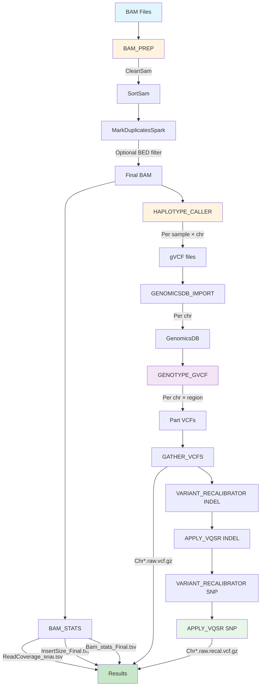

# Workflow Diagram

## Pipeline Steps

1. **BAM_PREP**: CleanSam → SortSam → MarkDuplicatesSpark → [BED region filter]
2. **BAM_STATS**: DepthOfCoverage, InsertSizeMetrics, samtools stats
3. **HAPLOTYPE_CALLER**: Per-sample per-chromosome gVCF generation
4. **GENOMICSDB_IMPORT**: Combine gVCFs into GenomicsDB per chromosome
5. **GENOTYPE_GVCF**: Joint genotyping per chromosome per region
6. **GATHER_VCFS**: Merge part VCFs into per-chromosome raw VCFs
7. **VARIANT_RECALIBRATOR + APPLY_VQSR**: VQSR filtering (INDEL → SNP chain)
